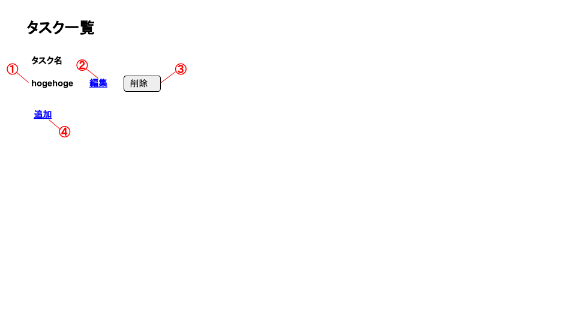

<link href="../css/markdown.css" rel="stylesheet"></link>

# 基本設計書

- [基本設計書](#基本設計書)
  - [1. 要件](#1-要件)
    - [1.1. 機能要件](#11-機能要件)
    - [1.2. 非機能要件](#12-非機能要件)
      - [稼働率](#稼働率)
      - [運用・保守](#運用保守)
      - [性能・拡張性](#性能拡張性)
  - [2. システム構成図](#2-システム構成図)
  - [3. 画面構成・機能](#3-画面構成機能)
    - [3.1. タスク一覧画面\[SCR-01\]](#31-タスク一覧画面scr-01)
      - [画面イメージ](#画面イメージ)
      - [コンポーネント仕様](#コンポーネント仕様)
      - [バリデーション仕様](#バリデーション仕様)
    - [3.2. タスク登録画面\[SCR-02\]](#32-タスク登録画面scr-02)
      - [画面イメージ](#画面イメージ-1)
      - [コンポーネント仕様](#コンポーネント仕様-1)
      - [バリデーション仕様](#バリデーション仕様-1)
    - [タスク編集画面\[SCR-03\]](#タスク編集画面scr-03)
      - [画面イメージ](#画面イメージ-2)
      - [コンポーネント仕様](#コンポーネント仕様-2)
      - [バリデーション仕様](#バリデーション仕様-2)

## 1. 要件
<!-- プロジェクトチームや開発者などで要求を客観的に分析しとりまとめた内容を記述する -->
### 1.1. 機能要件
<!-- 画面・機能などについてクライアントから求められる事項を記述する。 -->
* Todoタスクを登録する機能
* Todoタスクを一覧する機能
* Todoタスクを編集する機能
* Todoタスクを削除する機能

### 1.2. 非機能要件
<!-- プロジェクトに関係するものでシステム開発以外の要件を記述する。 -->
#### 稼働率
* 24時間365日稼働かつ、稼働率99%を保障すること

#### 運用・保守
* アプリケーションのログを出力し、正常に稼働しているかの監視を実施できること

#### 性能・拡張性
* 最大1千件のTodoが登録された際にも、画面の各種アクションのレスポンスが5秒以内に収まること
* 最大同時接続10人の際にも、画面の各種アクションのレスポンスが5秒以内に収まること

## 2. システム構成図


<div style="page-break-before:always"></div>

## 3. 画面構成・機能

```
タスク一覧画面[SCR-01](タスク一覧機能)
  ├ タスク登録画面[SCR-02]
  │  └ (タスク登録機能)
  ├ タスク編集画面[SCR-03]
  │  └ (タスク編集機能)
  └ (タスク削除機能)
```

### 3.1. タスク一覧画面[SCR-01]
#### 画面イメージ


#### コンポーネント仕様
| 識別番号 | コンポーネント名 | 種類 | 概要 | 入出力仕様 | サンプル | 備考 |
| :----------: | :----------: | :----------: | :----------: | :----------: | :----------: | :----------: |
| ① | タスク名テキスト | テキスト | DBから取得したタスク名を表示したテキスト | - | hogehoge  | |
| ② | 編集リンク | リンクテキスト | クリック時に対象行のタスクの編集画面へ移動するリンクテキスト | - | - | |
| ③ | 削除ボタン | ボタン | クリック時に対象行のタスクを削除するボタン | - | - | |
| ④ | 追加リンク | リンクテキスト | クリック時にタスク登録画面(SCR-02)へ移動するリンクテキスト | - | - | |

#### バリデーション仕様

<div style="page-break-before:always"></div>

### 3.2. タスク登録画面[SCR-02]
#### 画面イメージ


#### コンポーネント仕様
| 識別番号 | コンポーネント名 | 種類 | 概要 | 入出力仕様 | サンプル | 備考 |
| :----------: | :----------: | :----------: | :----------: | :----------: | :----------: | :----------: |
| ① | タイトル入力フォーム | 入力フォーム | タイトルを入力するフォーム | 入力制限なし | hogehoge | |
| ② | タスク登録ボタン | ボタン | クリック時に①に入力されている値でタスクを登録するボタン | - | - | |
| ③ | 戻るリンク | リンクテキスト | クリック時にタスク一覧画面(SCR-01)へ移動するリンクテキスト | - | - | |

#### バリデーション仕様

### タスク編集画面[SCR-03]
#### 画面イメージ


#### コンポーネント仕様
| 識別番号 | コンポーネント名 | 種類 | 概要 | 入出力仕様 | サンプル | 備考 |
| :----------: | :----------: | :----------: | :----------: | :----------: | :----------: | :----------: |
| ① | タイトル入力フォーム | 入力フォーム | タイトルを入力するフォーム | 入力制限なし | hogehoge | |
| ② | タスク登録ボタン | ボタン | クリック時に①に入力されている値でタスクを更新するボタン | - | - | |
| ③ | 戻るリンク | リンクテキスト | クリック時にタスク一覧画面(SCR-01)へ移動するリンクテキスト | - | - | |


#### バリデーション仕様

<div style="page-break-before:always"></div>
