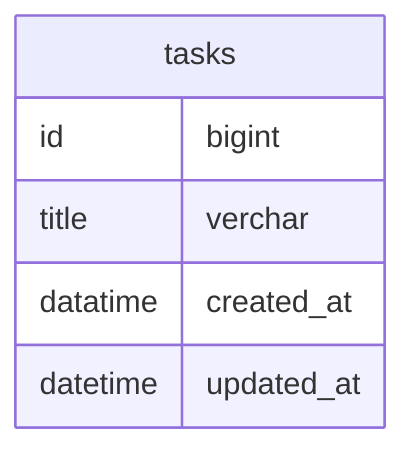
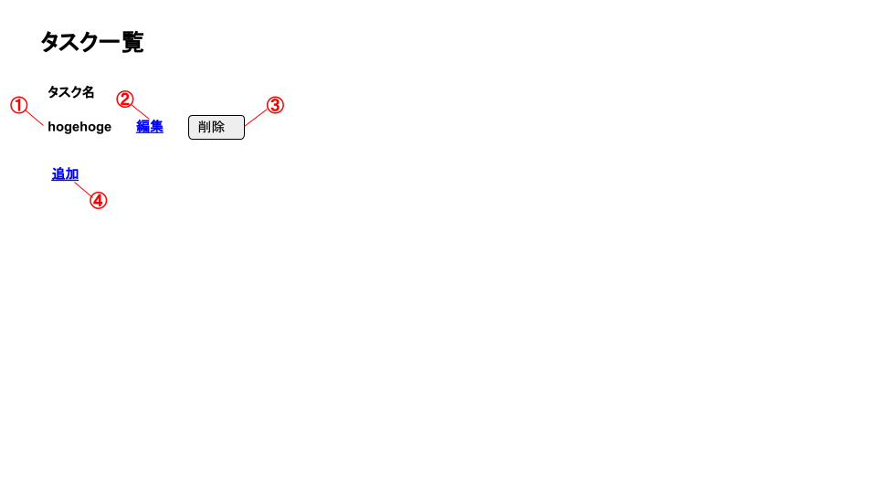
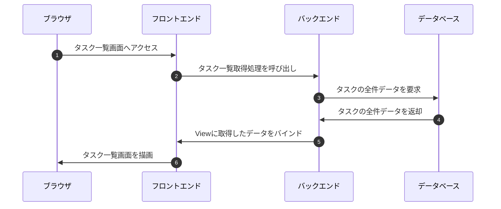
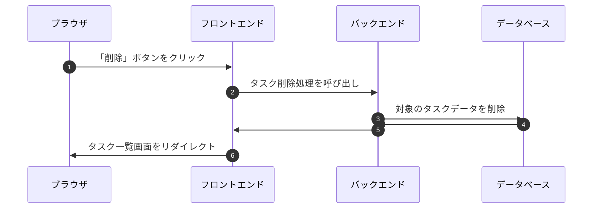
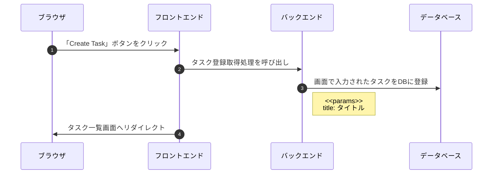
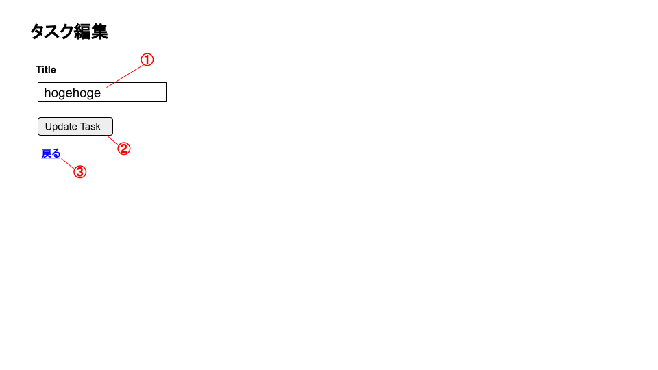

<link href="../css/markdown.css" rel="stylesheet"></link>

# 詳細設計書

- [詳細設計書](#詳細設計書)
  - [1. テーブル設計](#1-テーブル設計)
    - [タスクテーブル tasks](#タスクテーブル-tasks)
  - [2. ER図](#2-er図)
  - [3. 内部設計](#3-内部設計)
    - [3.1. タスク一覧画面\[SCR-01\]](#31-タスク一覧画面scr-01)
      - [バインディング](#バインディング)
      - [内部設計](#内部設計)
    - [3.2. タスク登録画面\[SCR-02\]](#32-タスク登録画面scr-02)
      - [バインディング](#バインディング-1)
      - [内部設計](#内部設計-1)
    - [3.3. タスク編集画面\[SCR-03\]](#33-タスク編集画面scr-03)
      - [画面イメージ](#画面イメージ)
      - [バインディング](#バインディング-2)

## 1. テーブル設計
### タスクテーブル <small>tasks</small>
◆ Todoタスクに関する情報が格納されたテーブル

| No. | カラム名 | 属性名 | 概要 | データ型 | Not Null | Default | Example | 備考 |
| :------- | :----------: | :----------: | :----------: | :----------: | :----------: | :----------: | :----------: | :----------: |
| 1 | id | タスクID | サロゲートキー | bigint | ● | 自動発番 | 1 | |
| 2 | title | タイトル | タスクのタイトル | varchar | ● | | タイトル | |
| 3 | created_at | 作成日時 | レコード作成日時 | datetime | ● | | 2022-01-01 00:00:00 | |
| 4 | updated_at | 更新日時 | レコード更新日時 | datetime | ● | | 2022-01-01 00:00:00 | |

## 2. ER図

## 3. 内部設計

### 3.1. タスク一覧画面[SCR-01]

#### バインディング
| 識別番号 | データソース | フォーマット | 備考 |
| :----------: | :----------: | :---------- | :----------: |
| ① | tasks.title | | |
| ② | tasks.id | 以下のリンク形式に加工する <small>表示値：`編集` URL：`/tasks/:id/edit` HTTPメソッド: `POST`</small> | タスク編集画面へリンク|
| ③ | tasks.id | 以下のボタン形式に加工する <small>表示値：`削除` URL：`/tasks/:id/` HTTPメソッド: `DELETE`</small> | |
| ④ | | 以下のボタン形式に加工する <small>表示値：`追加` URL：`/tasks/new` HTTPメソッド: `GET`</small> | タスク登録画面へリンク |

#### 内部設計
▼ タスク一覧取得処理 
タスク一覧画面が描画される際にCallされる処理。

▼ タスク削除処理 
③のボタンがクリックされた際にCallされる処理。

 
 

 
 

### 3.2. タスク登録画面[SCR-02]

#### バインディング
| 識別番号 | データソース | フォーマット | 備考 |
| :----------: | :----------: | :---------- | :----------: |
| ② | | 以下のボタン形式に加工する <small>表示値：`Create Task` URL：`/tasks` HTTPメソッド: `POST`</small> | |
| ③ | | 以下のリンク形式に加工する <snmall>表示値：`戻る` URL：`/tasks` HTTPメソッド: `GET`</small> | |

#### 内部設計
▼ タスク登録処理 
②のボタンがクリックされた際にCallされる処理。

③ タスクデータ INSERT情報
| テーブル名 | カラム名 | 登録値 | Example | 備考 |
| :----------: | :----------: | :---------- | :----------: | :----------: |
| tasks | id | 自動発番 | 1 | |
| tasks | title | 画面で入力されたタスク名の値 | hogehoge | |
| tasks | created_at | 登録処理実行日時 | 2022-01-01 00:00:00 | |
| tasks | updated_at | 登録処理実行日時 | 2022-01-01 00:00:00 | |

 
 

 
 

### 3.3. タスク編集画面[SCR-03]
#### 画面イメージ

#### バインディング
| 識別番号 | データソース | フォーマット | 備考 |
| :----------: | :----------: | :---------- | :----------: |
| ① | tasks.title | | |
| ② | tasks.id | 以下のボタン形式に加工する <small>表示値：`Upadate Task` URL：`/tasks/:id` HTTPメソッド: `POST`</small> | |
| ③ | | 以下のリンク形式に加工する <small>表示値：`戻る` URL：`/tasks` HTTPメソッド: `GET`</small> | |

